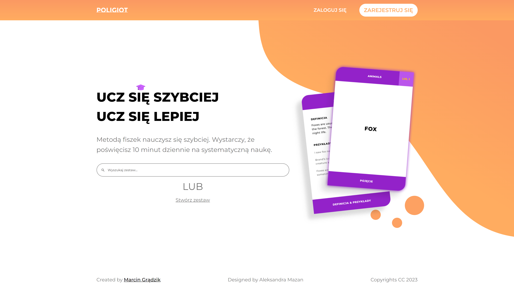

# Poliglot Backend

Learn faster by using flashcards. All you need to do is spend 10 minutes a day to study systematically.

[](https://mg.aw3.pl/home)


## Demo

[Check out our app in action!](https://mg.aw3.pl/home)


## Tech Stack

**Server:** Node, Express, MongoDB, Jest, JavaScript

**Client:** Angular, SCSS, Typescript

[Client repository](https://github.com/marcing20067/poliglot-frontend)
  

## Installation

```bash
  npm install 
```


## Testing

```bash
npm run test
```


## Usage

```bash
ng serve
```

## Copyright

**Code:** Me

**Design:** Aleksandra Mazan
